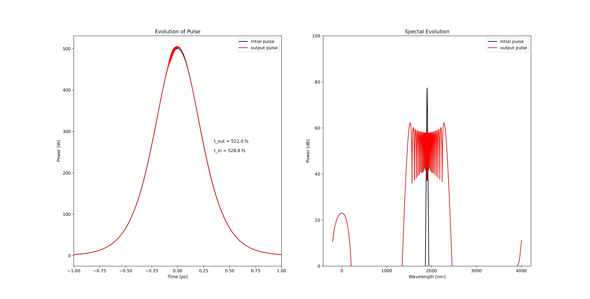
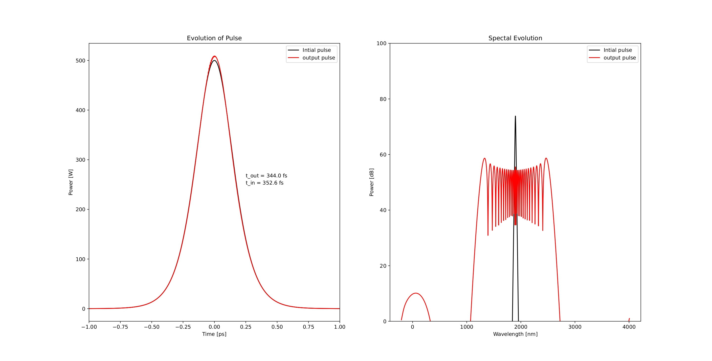
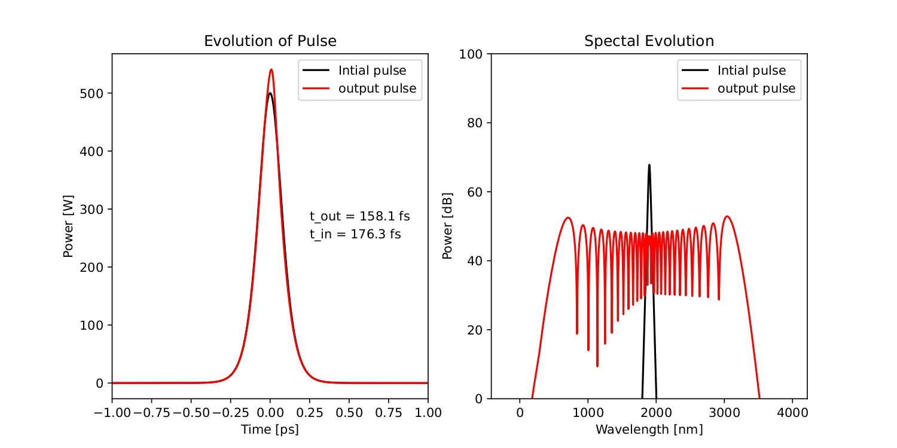

# Supercontinuum Generation in an Integrated Waveguide using Split Step Fourier Method

This project simulates ultrashort pulse propagation and spectral broadening in an integrated nonlinear waveguide platform using the Split Step Fourier Method (SSFM).

The simulation investigates how dispersion and nonlinear effects interact during pulse propagation to generate broadband spectra (supercontinuum generation).

Developed during my internship work in ultrafast photonics and nonlinear waveguide optics.

---

## Overview

Supercontinuum generation is a nonlinear optical phenomenon in which a narrow-band ultrashort laser pulse evolves into a broadband optical spectrum.

This simulation models pulse evolution through:

- Single Mode Fiber (SMF)
- Integrated Nonlinear Waveguide (WG)
- Dispersion effects
- Kerr nonlinearity
- Spectral broadening
- Higher order dispersion terms (up to β₁₀ support)

The propagation is solved numerically using the Split Step Fourier Method.

---

## Physical Effects Included

### Linear Effects
- Group Velocity Dispersion (β₂)
- Third Order Dispersion (β₃)
- Higher Order Dispersion (β₄–β₁₀)

### Nonlinear Effects
- Self Phase Modulation (SPM)
- Kerr Nonlinearity
- Pulse Compression
- Spectral Broadening

### Components Supported
- Single Mode Fiber (SMF)
- Nonlinear Waveguide
- Dispersion Compensating Fiber (DCF)
- Erbium Doped Fiber (EDF)
- Saturable Absorber
- Optical Filter

---

## Simulation Parameters

| Parameter | Value |
|----------|-------|
| Central Wavelength | 1960 nm |
| Spectral Window | 350 THz |
| Grid Size | 4096 points |
| Initial Pulse Duration | 4.4 ps |
| Peak Power | 2 kW |
| Waveguide Length | 1 mm |
| Numerical Method | Split Step Fourier Method |

---

## Method

The pulse evolution is computed using the nonlinear Schrödinger equation:

\[
\frac{\partial A}{\partial z}
=
-\frac{i\beta_2}{2}\frac{\partial^2A}{\partial t^2}
+
i\gamma |A|^2A
\]

The simulation alternates between:

1. Nonlinear propagation in time domain
2. Linear propagation in frequency domain
3. Iterative propagation along the device

---

## Results

### Pulse Evolution

Comparison between input and output temporal pulse profiles for different initial pulse durations at a fixed peak power.

Simulation condition:

- Peak Power: **P = 0.5 kW**

---

#### Pulse Duration = 300 fs



---

#### Pulse Duration = 200 fs



---

#### Pulse Duration = 100 fs



---

### Observations

- Pulse reshaping occurs during propagation due to nonlinear interactions.
- Shorter pulses experience stronger nonlinear effects.
- Temporal compression and spectral broadening become more pronounced for reduced pulse duration.
- Broadband supercontinuum generation becomes increasingly efficient as pulse duration decreases.

---

### Spectral Evolution

Comparison between input and output optical spectra.

Observed:

- Spectral broadening
- Supercontinuum generation
- Nonlinear frequency conversion

---

## Conclusion

The simulations show that decreasing the input pulse duration leads to significantly broader generated spectra.

Shorter optical pulses have higher peak intensity for the same pulse energy, which enhances nonlinear optical effects such as self phase modulation (SPM). As a result, stronger frequency generation occurs and the output spectrum expands.

Among the tested conditions:

- **300 fs** → Narrowest spectral broadening
- **200 fs** → Intermediate broadening
- **100 fs** → Largest spectral broadening

This demonstrates the strong dependence of supercontinuum generation efficiency on ultrashort pulse duration and nonlinear interaction strength.

### Temporal Propagation Along Waveguide

Pulse evolution as a function of propagation distance.


Observed:
- Pulse compression
- Nonlinear pulse dynamics
- Evolution of temporal envelope

---

### Spectral Broadening Along Propagation

Evolution of optical spectrum during propagation.


Observed:
- Progressive bandwidth expansion
- Supercontinuum formation
- Dispersion–nonlinearity interaction

---

## Requirements

Install dependencies:

```bash
pip install numpy matplotlib scipy pyqtgraph addict
```

---

## Run

```bash
python SC_on_chip_best_khan.py
```

---

## Skills Demonstrated

- Python Scientific Computing
- Nonlinear Optics
- Supercontinuum Generation
- Waveguide Photonics
- Split Step Fourier Method
- Dispersion Engineering
- Numerical Simulation
- Scientific Visualization

---

## Author

Mohammad Anas Khan

ICB Dijon 
Internship in Ultrafast Photonics and Waveguide Optics
